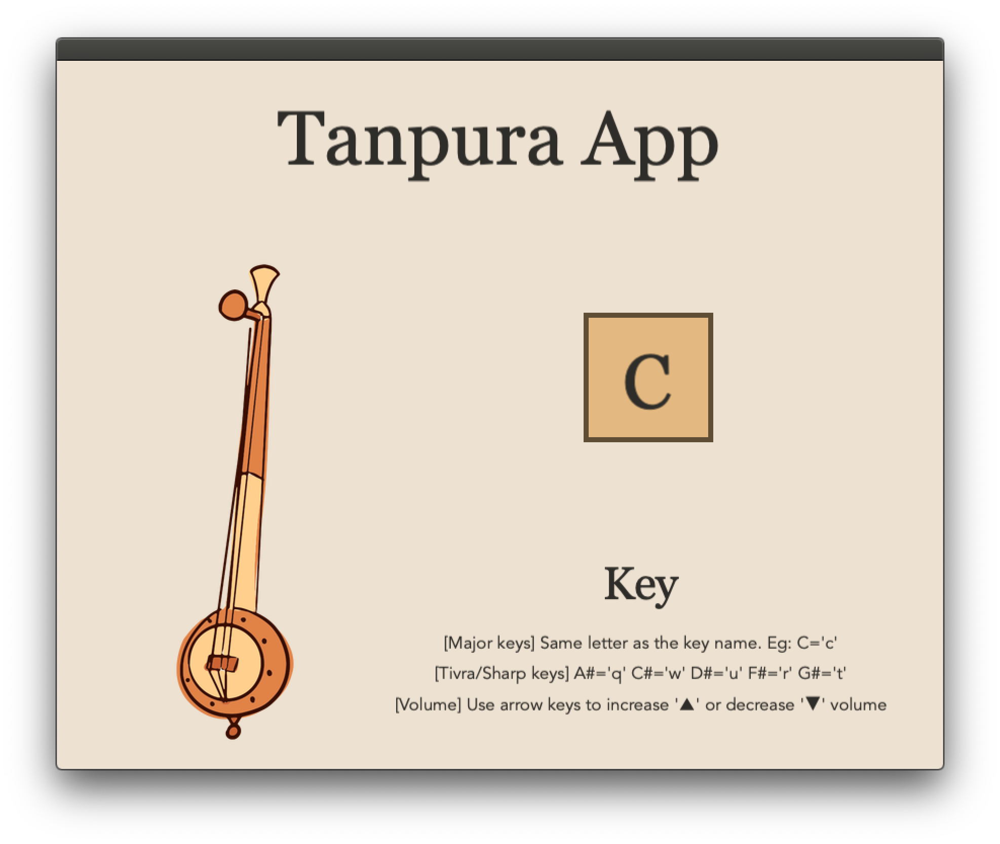

# Tanpura-App

# Description
Tanpura is a string instrument that is plucked to help Indian classical musicians practice. Tanpura-App is my attempt to emulate that experience using Cinder and C++.

With this app, you can practice with tanpura in every key in the major scale. Additionally, you can also adjust the volume of the Tanpura. 

Happy Practicing!

# Installation
This project is currently stable for MacOS. Other platforms have yet to be tested. This installation requires the [CLion IDE](https://www.jetbrains.com/clion/)

### Setting up Cinder
This project requires the Cinder framework. First, we need to set up Cinder. These instructions are modified from [UIUC Spring 2021 Ideal Gas](https://courses.grainger.illinois.edu/cs126/sp2021/assignments/ideal-gas/)
* Download [Cinder](https://libcinder.org/download) (v0.9.2) for you platform
* Extract the downloaded item into a folder. We will call this folder `~/Cinder`
* Follow the [Instructions](https://www.libcinder.org/docs/guides/cmake/cmake.html#building-libcinder-with-cmake) for building LibCinder with CMake
* * Alternatively, if using the CLion IDE, navigate to ~/Cinder and select `Run` -> `Build`
### Running the Project
* Create a directory called `my-projects` in `~/Cinder`. Navigate to `my-projects` and clone this repository inside.
* From here, you can run the cloned project in CLion

# Functions
The core controls are displayed in a helpful key when your run the _Tanpura_ app.
### Controls
| Key        | Action                                                                 |
| ---------- | -----------------------------------------------------------------------|
| `ABCDEFG`  | Play Tanpura of Major Keys (A,B,C,D,E,F,G)                             |
| `QWURT`    | Play Tanpura of Sharp/Tivra Keys (A#,C#,D#,F#,G#)                      |
| `Up`       | Increase Volume                                                        |
| `Down`     | Decrease Volume                                                        |

# Credits
## Sound Files
- [Anubodh](https://www.anubodh.com/tanpura.php)
## Images
- [Vexels](https://www.vexels.com/png-svg/preview/191182/indian-musical-instrument-tanpura-hand-drawn)
